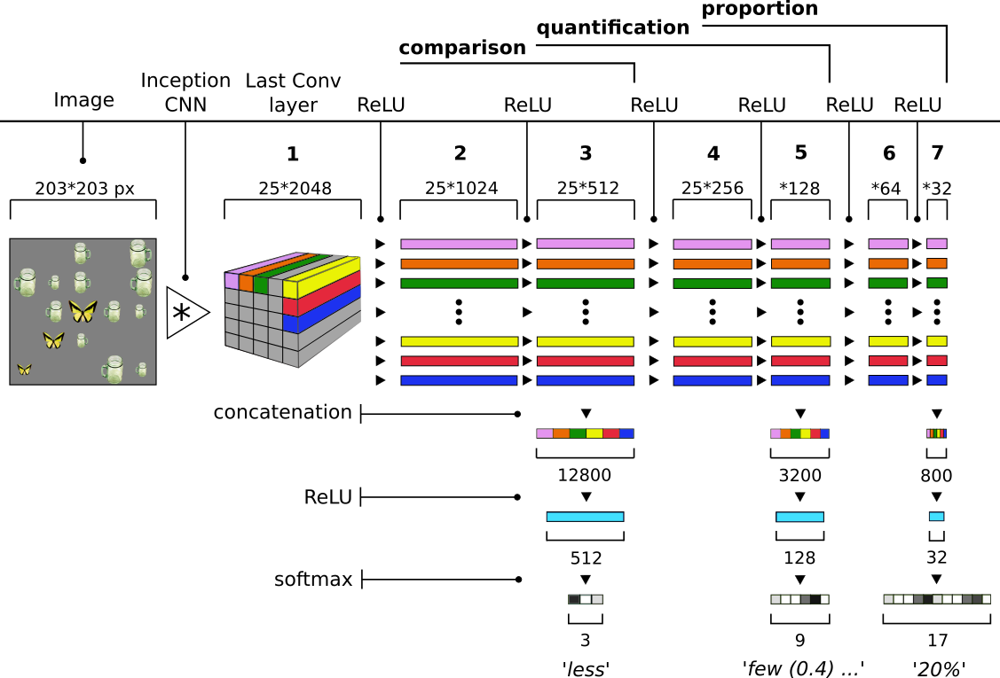

# multitask-quant
Codes and data used in Pezzelle, Sorodoc, Bernardi (2018). "Comparatives, Quantifiers, Proportions: A Multi-Task Model for the Learning of Quantities from Vision"
Proceedings of NAACL-HLT 2018

Data can be downloaded from here:

[images (8.6gb)](https://drive.google.com/open?id=1cerhp4P8qfc6GUuuoSMsFwfbyZcqhDd4)
[best models weights (860mb)] (https://drive.google.com/open?id=1SLUOx0CHWG3FCgrs6F8OKwPSYuAzD_m-)
[frozen inception visual features (120mb)](https://drive.google.com/open?id=17fc9T4kyWPzhrCYCda0-jV9tI-pUMhKI)

For questions, additional info, feedback please contact:
sandro.pezzelle@unitn.it
